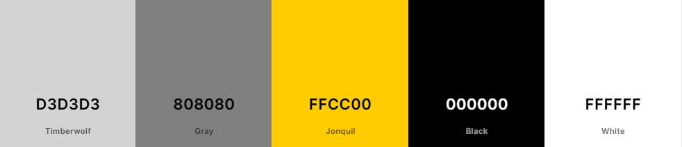
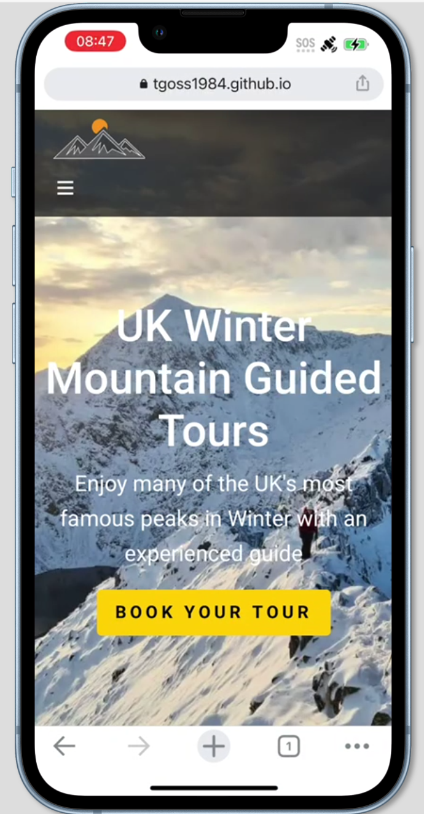
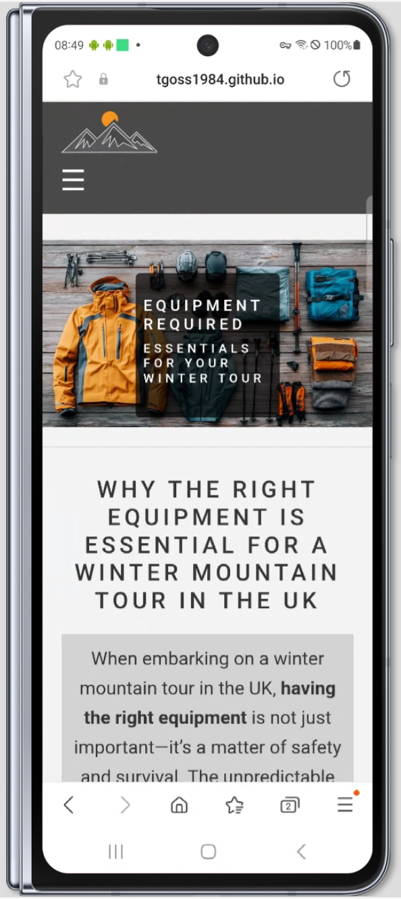
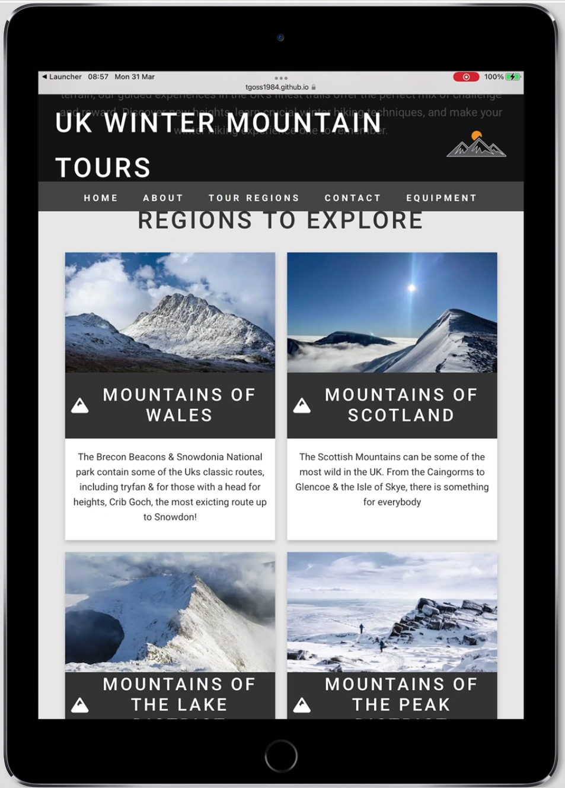

# UK Winter Mountain Tours

Welcome to the **UK Winter Mountain Tours** website. This site is dedicated to providing expert-guided winter mountain hiking tours across some of the UK’s most famous peaks. Whether you're a seasoned hiker or a beginner, Tom's tours offer a safe and memorable hiking experience.

The website was setup to offer the general public an opportunity to experience some the of the UK's best mountain routes in the Winter with an experienced guide to support them along the way. Users of the website will be able to read about what is on offer with the guided tours, the regions available to choose from, the equipment that is required, a 'contact us' section for general enquiries & finally a booking form to book a tour.

This website has been built to be responsive on both mobile devices & larger screens such as tablets and desktop screens.

  

**LINK TO GIT HUB PROJECT BELOW**

[Link to GitHub project](https://tgoss1984.github.io/mountain-project-submission/)

## Table of Contents
- [**Description**](#description)       
    - [User Experience](#user-experience) 
- [**Features**](#features)
    - [Main Features](#main-features)
    - [Features for Future Development](#features-for-future-development)
    - [Design](#design)
- [**Deployment**](#deployment)    
- [**Testing**](#testing)
    - [Browser and Device Testing](#browser-and-device-testing)
    - [Device and Responsive Testing](#device-and-responsive-testing)
    - [HTML Validation](#html-validation)
    - [CSS Validation](#css-validation)
    - [Lighthouse Tests](#lighthouse-tests)
    - [Solved Bugs](#solved-bugs)
    - [Unfixed Bugs](#unfixed-bugs)    
- [**Technologies Used**](#technologies-used)
    - [Languages](#languages)
    - [Technology](#technology)
- [**Credits**](#credits)
    - [Content Links](#content-links)
    - [Media Links](#media-links)

## Description

### User Experience

This website has been designed for individuals looking to explore the UK’s most iconic winter landscapes through guided mountain hikes. Tom Goss, an experienced hiker, offers tours across various regions of the UK, including:

- Lake District
- Snowdonia
- Scottish Highlands
- Peak District

Users can book their winter mountain tours, learn about the different regions, view required hiking equipment, get in touch for inquiries & finally, book a tour through the website. The site is designed to be responsive and user-friendly, providing a seamless booking experience and access to important information about the tours.

## Features

### Main Features

- **Navigation & Header**: A Navbar featured at the top of all pages. The Navigation Bar shows the name of the website along with the main sections/pages. All descriptions are clickable links to the pages / sections of the website. The Navbar items are designed so that when hovering over the color changes so the user can clearly see where they are clicking. The main header is fixed at the top of the page along with the Navbar and is set to 70% opacity so content can still be visible beneath when scrolling. A png image icon has also been added to the right of the header as the main logo. The main header/logo & Navbar are responsive and will adjust accordingly depending on the device in use. On smaller smaller screens such as ipads, the header text size decreases and also the navbar is displayed as a hamburger icon and can be clicked to show the navbar items as a column as opposed to a row. On the smallest screens, the header becomes hidden and only the logo remains.

  

  

  

- **Homepage**: Introduction to Tom Goss' UK Winter Mountain Guided Tours with a call to action button to book a tour. The background image is of Crib Goch, a famous ridgeline on route to Snowdon, the highest mountian in Wales. This image shows Crib Goch & Snowdon in Winter conditions to set the mood of the website. In the center of the image is a header with a description of the website along with a supporting tag that gives the user more information of what they can expect. Beneath this is a call to action which links to the booking section. Clicking the home button takes the user back to this page.

  

- **About Section**: Details about the services and expertise Tom brings to his winter mountain hiking tours. Gives the user more information about what to expect on a guided tour and some information about why the website was created and what it offers.
- **Tour Regions Section**: Highlighting various tour regions such as the Lake District, Scotland, Wales, and the Peak District with brief desriptions about some of the hikes available along with images. 'Cards' have been used to visually display this section. This section is responsive and is diplayed as four cards in a row on larger screens and will dynamically move to a stacked column on mobile devices.

  

- **Booking Section**: A direct link to the booking page.

  

- **Contact Section**: Contact form for any inquiries or questions. The 'Required' attribute has been added to all fields to tell the user that the field is required in order to submit.

  

- **Booking Page**: A page with a booking form to book your tour. The 'Required' attribute has been added to all fields to tell the user that the field is required in order to submit. Information such as name, email, address, date, group size, special requests has been added to the booking form 

  

- **Equipment Page**: A page detailing the equipment required for hiking the mountains in Winter & why this is important. This page begins with an image of hiking equipment on a table along with a header which begins at the bottom right of the image but is responsive and moves to the middle of the image on smaller screen sizes. There are two paragraphs of text explaining the importance of the correct equipment and some safety information. Below this there is an accordion with four titles for Clothing, Equipment, Food & Drink & Emergency Items. These buttons can be clicked to expand/collapse to show a list of items below with further details. This was added to reduce the visual length of lists contained within giving the user an option to drill down. At the bottom there is a Call to Action button which links to the booking page.

  

  

- **Footer with legal information & Social Media Links**: Links to Facebook, Instagram, and Twitter. Clicking these links opens a new tab with the relevant landing page. Legal information such as Terms & Conditions, copyright & contact information can be found here.

  

### Features for future Development
 - **Gallery/Detailed Route Descriptions & Prices**: Make the Region Cards clickable to see a gallery of photos from these routes along with detailed information on route difficulty/length/location start & end points etc along with pricing information. Attribute tag has been kept here with a hash in the href and a comment to show that this is a placeholder for future development.
 - **Terms & Conditions**: The Terms & Conditions contained in the footer would be a clickable link to a T&Cs page with full details. Attribute tag has been kept here with a hash in the href and a comment to show that this is a placeholder for future development.

### Design

The website has been created with 3 pages (with the homepage having several sections), for easy navigation & seperation of information. All pages are linked with an intuitive navigation bar and can be accessed from each other. The nav bar has been designed to work on a range of devices. The general colour themes of the website are followed through each page for consistency. Contrast has been used for text along with image alternative descriptions for accessibility best practice.

#### Main Colours used

Use of Greys, Blacks and White's to provide a clean but also Wintery aesthetic. to the website. The Call to Action buttons use a vibrant Yellow, not only to stand out to the user but also to link in with the hero image on the landing page and to reference Winter Sun. 

  

#### Font

Used Roboto from Google Fonts across the website as the main font & for all headers used uppercase & letter spacing for clear descriptions. 

## Deployment

**Used VSCode to build & GitHub for deployment of the website.**

- **VSCode**
    - Code was written in VSCode.
    - html & readme.md were added to the main folder and a sub-folder was created named assests wherein images/css style sheet & Javascipt were kept

- **GitHub**
    - A GitHub account was created
    - A new reposiory was created on GitHub by clicking the 'New' button. It was named and set as public.  
    - A folder was created in VSCode and initialised as a Git repository
    - In VSCode the terminal was used to run commands to link the local project to the GitHub repository
    - Throughout the process of builing the website, commits & pushes were staged regularly using terminal commands such as 'git add .' , 'git-commit -m' & 'git push'
    - Host the project: Went to my GitHub repository, clicked settings > pages and selected the branch to publish, hit save and then GitHub generated a live link (link at top of readme) 
    
## Testing

## Browser and Device Testing

[Browserstack](https://www.browserstack.com/?utm_source=bing&utm_medium=cpc&utm_platform=paidads&utm_content=&utm_campaign=Bing-Search-Brand-Tier1-EMEA-CL&utm_campaigncode=BrowserStack-Alpha+41752&utm_term=e+browserstack&msclkid=3d18b644641d13bfb677d1ae33798480) was used to test the site on multiple browsers on desktop and mobile.

| Browser | Device | Outcome of testing? |
|----------|----------|----------|
| Edge | Windows Desktop | Responsive, links/buttons worked |
| Chrome | Iphone 13 | Responsive, links/buttons worked |
| Firefox | Galaxy Z Fold 6 | Responsive, links/buttons worked |
| Safari | Ipad9 | Responsive, links/buttons worked |

**Screenshot examples below**

  

  

  

## HTML Validation

Code was validated using HTML Validation 

- [HTML Validator](https://validator.w3.org/#validate_by_input)

  

## CSS Validation

Code was validated using CSS Validation

- [CSS Validator](https://jigsaw.w3.org/css-validator/)

  

### Lighthouse Tests

Lighthouse Homepage test results - 

**Homepage**

  

**Booking Page**

  

**Equipment Page**

  

**General Site Testing**

    - I checked that this site was responsive using not only Browserstack but also devtools device toolbar, checking different screen sizes
    - I confirmed that the navigation, header/logo, about, contact us, booking form and equipment sections/pages are all readable and easy to understand
    - I have confirmed that both the contact us section & the booking page form works: requires entries in all fileds (using required attribute) will, only accpect email in the email field and the submit buttons work. 

### Solved Bugs

During testing on the HTML Validator/CSS Validator & Lighthouse I found the following bugs/errors which were fixed to improve performance scores -

    - When testing on HTMl validator, discovered that more than one H1 was is use - this was corrected and helped with best practice score
    - When testing on lighthouse, loading times were initially slow. This was caused by images on page. They needed resizing and also needed to adjust some aspect ratios. I also discovered that images that were not onscreen could use 'lazy loading'. Adjusting these things improved the performance score considerably.
    - Content Layout Shift. On the equipment page I orginally had an unordered list which was a rather large wall of text. There also were no explicit width px set. This caused slow down on the page. I decided to replace with bootsrap accordion and ensured width was added which imporved performance and also led to better visual look.
    - Laregst Contentful Paint - this was caused by the hero image on the home page being too large, all images were resized and optimised which led to improved performance
    - When testing the booking page on lighthouse I found that the select element would work better with a placeholder which was added
    - When testing the equipment page, initially the accesability was lower due to not enough contrast on some elements, made text lighter and background darker to stand out more on the accordion headers (when expanded)
    - When testing in a live environment using 'live server' extension I noticed that image links were broken. This was because I was using the ../ path. Removing the ../ and beginning with assets solved this.

### Unfixed Bugs

No unfixed bugs

## Technologies Used

### Languages

**Languages Used**

    - HTML
    - CSS
    - Javascript (only foe use of Hamburger menu)

### Technology

    -VSCode
    -GitHub
    
## Credits

    - For the code used in the contact section , the Portfolio project by code institute was used. Whilst initially from bootstrap, the adjusted code fit to what was required on the page as it had already deleted elements
    - Whilst code was not copied directly, inspiration was taken from some of the code in the code institute love running project
    - Used code institute location 'action' for both contact & booking forms link (https://formdump.codeinstitute.net/)
    - Bootsrap was used for the accordion section on the equipment page (link below)
    - Fav Icons taken from icons8 website (link below)
    - PNG image on logo taken from pngimg website (link below)
    - Social Media icons / booking form icon / region card icons taken from Font Awesome website (link below)
    - Main Roboto font was taken from Google Fonts (link below)
    - Images taken from google images

### Content Links

- [Link to Bootsrap](https://getbootstrap.com/)
- [Link to Google Fonts](https://fonts.google.com/)

### Media Links

- [Link to Font Awesome](https://fontawesome.com/)
- [Link to pngimg](https://pngimg.com/)
- [Link to icons8](https://icons8.com/icons)

## Author

Tom Goss